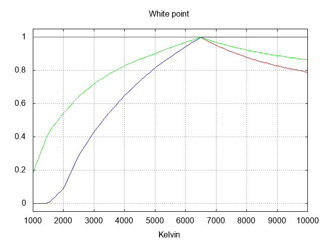

Set Color Temperature
---------------------

sct is a transliteration of Ted Unangst
[sct](http://www.tedunangst.com/flak/post/sct-set-color-temperature)
application in Go

Install
=======

    go get github.com/dim13/sct

Usage
=====

* Campfire style: `sct -temp 4500`
* Dust storm on Mars style: `sct -temp 2000`
* Coffee free all nighter style: `sct -temp 8000`

White points
============

